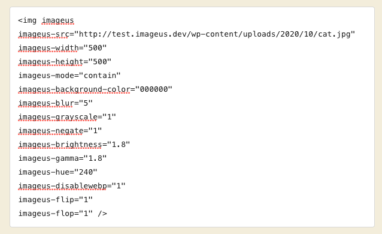
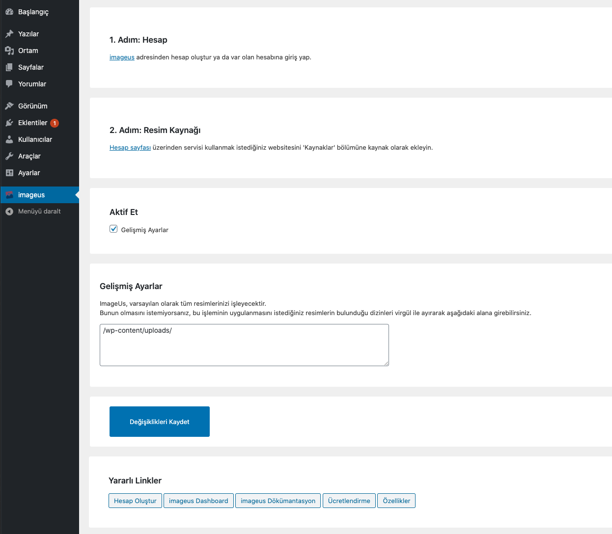

# ImageUs Wordpress Eklentisi

ImageUs Resmi Wordpress Eklentisi
[https://imageus.dev/](https://imageus.dev/)

# Eklenti Özellikleri

Bu eklenti tüm resimlerinizi, ImageUs servisinin sunduğu aşağıdaki özellikler ile otomatik olarak optimize eder:

- Onlarca filtre
- %65'e kadar daha küçük resimler
- WebP desteği
- Hızlı CDN
- SEO dostu
- Retina Display desteği

## Manuel Kurulum

ImageUs WordPress Eklentisi, Wordpress panelinizde "Eklentiler -> Yeni Ekle" sayfası altından "ImageUs" etiketi aratılarak kurulabilir, ya da manual kurulum için aşağıdaki adımlar takip edilebilir:

1. Eklentiyi yandaki link aracılığıyla indirin [ImageUs Wordpress Eklentisi](https://wordpress.org/plugins/imageus).
2. İndirdiğiniz ZIP dosyasını Wordpress panelinizin 'Eklentiler > Yeni Ekle > Yükle' sayfasından kurun.
3. Eklentiyi "Eklentiler" sayfasından aktifleştirin.
4. Eklenti ayarlarına giderek gerekli adımları tamamlayın.

## Eklentiyi Ayarlama

### Eklenti Kullanımı

Eklentiyi kurup aktifleştirdikten sonra Wordpress panelinizde "ImageUs" sayfasında gerekli ayarları ve talimatları görüntüleyebilirsiniz. Eklentinin doğru kullanımı için buradaki talimatları okuyup uygulamayı unutmamalısınız.

## Kullanım

Eklentiyi aktifleştirdiğinizde ve gerekli düzenlemeleri yaptığınızda websitenizdeki tüm resimler optimize edilmektedir.

### Özelleştirilebilir Kullanım

Eğer dilerseniz filtrelerinizi manuel olarak aşağıdaki resimde belirtildiği gibi uygulayabilirsiniz:

Tüm eklenti seçeneklerine <a href="https://imageus.dev/tr/gelistiriciler-icin">bu</a> adresten ulaşabilirsiniz.

## Aşağıdaki Sürümlerde Test Edildi

WordPress

- 4.9.x
- 5.2.x
- 5.3.x
- 5.5.1
